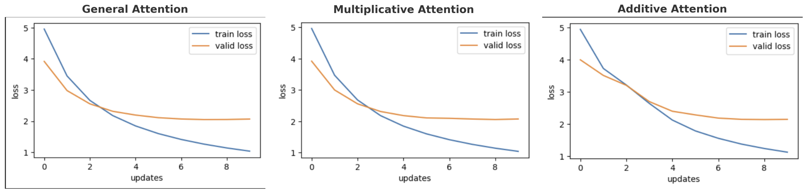
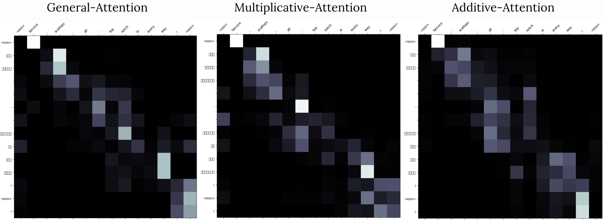
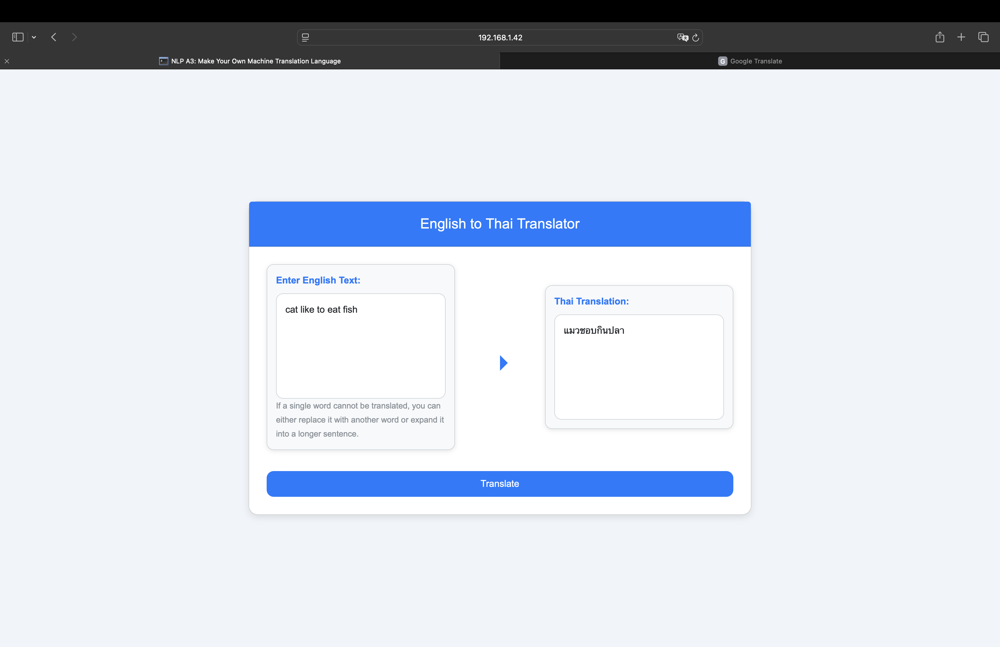

# English-Thai Texts for Machine Translation + Transformer + Attention

This repository provides resources for building and training machine translation models between English and Thai using the **English-Thai Texts Dataset** sourced from Hugging Face.

## Dataset Overview

The **English-Thai Texts Dataset** contains parallel text data with English sentences and their corresponding translations in Thai. This dataset is ideal for training machine translation models, NLP experiments, or research related to English-Thai language processing.

- **Dataset Name**: English-Thai Texts
- **Source**: [Hugging Face Datasets - English-Thai Texts](https://huggingface.co/datasets/kvush/english_thai_texts)
- **Language Pair**: English ↔ Thai
- **Number of Samples**: 59.9k
- **Content**: The dataset contains English sentences with their corresponding Thai translations, covering various topics and contexts.

Kvush. (2024). English-Thai Texts [Dataset]. Hugging Face. https://huggingface.co/datasets/kvush/english_thai_texts

## How to Load the Dataset

To load the dataset in your Python environment, you can use the `datasets` library from Hugging Face. Here’s a quick example:

```python
from datasets import load_dataset

# Load the English-Thai dataset
dataset = load_dataset("kvush/english_thai_texts")

# Preview the data
print(dataset["train"][0])  # Print the first entry from the training set
```

## Preprocessing dataset

The process of preparing a dataset for a translation model involves several key steps, including text normalization, tokenization, and word segmentation. These steps are crucial for handling both the source and target languages appropriately, especially when working with languages that have specific requirements. Let’s walk through these tasks in detail, particularly for handling a pair of languages like English and Thai, as you've shown in your example.

### 1. **Text Normalization** (Optional)

Text normalization is an important preprocessing step before tokenization. This step helps standardize the text by addressing common variations, ensuring that the text is clean and consistent, which can improve model performance. 

Common normalization tasks include:

- **Lowercasing**: Converting all text to lowercase to reduce variability (though this may not apply for case-sensitive languages like Thai).
- **Removing special characters**: This includes punctuation, extra spaces, or other non-alphabetic characters that might not be useful for translation.
- **Removing stop words**: Depending on the task, you might want to remove frequent words that don’t carry much meaning in the context of translation.

For English, the Spacy `en_core_web_sm` model handles basic normalization tasks, while for Thai, PyThauNLP is used. As a result, we have opted not to include a separate text normalization step.

### 2. **Tokenization**
Tokenization is the process of splitting text into smaller units (tokens), typically words or sub-words, that a model can understand and process. The choice of tokenizer depends on the language being used.

#### For English:
- **Spacy** is a widely used library for tokenization in English. The `get_tokenizer` function from `torchtext.data.utils` can be used in combination with Spacy’s pre-trained models like `en_core_web_sm` to tokenize English text. This tokenizer handles punctuation and spaces in a way that is suited for English text.
  
```python
from torchtext.data.utils import get_tokenizer
token_transform[SRC_LANGUAGE] = get_tokenizer('spacy', language='en_core_web_sm')
```

#### For Thai:
- **Thai tokenization** presents a unique challenge because Thai text does not use spaces between words. Therefore, word segmentation is necessary to identify where words begin and end. Libraries like **PyThaiNLP** provide tools for word segmentation specifically designed for Thai text.
  
```python
from pythainlp import word_tokenize

def thtokenizer(sentence):
    return word_tokenize(sentence)
  
token_transform[TRG_LANGUAGE] = thtokenizer
```

The `word_tokenize` function from PyThaiNLP handles the segmentation of Thai text, ensuring that words are correctly identified.

### 3. **Word Segmentation for Thai**
In languages like Thai, where word boundaries are not explicitly marked by spaces, tokenization is more complex. The tokenization process must involve word segmentation techniques. PyThaiNLP is one of the best tools for this task, as it uses dictionary-based methods, machine learning, and rule-based approaches to segment Thai text accurately.

For example:
- **Preprocessing**: Before tokenization, Thai text might require cleaning, such as removing Thai punctuation or non-word characters.
- **Tokenization**: The `word_tokenize` function segments the sentence into words, which is crucial for training a translation model.

```python
# Example sentence in Thai
sample_sentence = "ฉันรักแมว"

# Tokenize using PyThaiNLP
tokens = thtokenizer(sample_sentence)
print(tokens)  # Output: ['ฉัน', 'รัก', 'แมว']
```

This segmentation ensures that the model understands each individual word in the context of Thai.

### 4. **Creating Vocabulary**
Once the text is tokenized, the next step is to build vocabularies for both the source and target languages. Vocabularies are essential because they map tokens to indices that are used in training the model. Special tokens such as `<unk>`, `<pad>`, `<sos>`, and `<eos>` are added to the vocabulary to handle unknown tokens, padding, and sequence boundaries.

In this code, the `build_vocab_from_iterator` function from **torchtext** is used to create vocabularies for both languages, ensuring that each token is assigned a unique index:

```python
from torchtext.vocab import build_vocab_from_iterator

# Define special tokens
special_symbols = ['<unk>', '<pad>', '<sos>', '<eos>']

for ln in [SRC_LANGUAGE, TRG_LANGUAGE]:
    vocab_transform[ln] = build_vocab_from_iterator(yield_tokens(train, ln),
                                                     min_freq=2,  # Ignore tokens that appear less than 2 times
                                                     specials=special_symbols,
                                                     special_first=True)
```

The vocabularies are built from the training dataset by iterating over the data and collecting the tokens. Special symbols are included at the start of the vocabulary to ensure they are treated appropriately during training.

### 5. **Setting Default Indices**
After building the vocabulary, we set the default index for out-of-vocabulary (OOV) tokens. This ensures that any token not present in the vocabulary will be mapped to `<unk>`:

```python
for ln in [SRC_LANGUAGE, TRG_LANGUAGE]:
    vocab_transform[ln].set_default_index(UNK_IDX)
```

This step is important because it prevents errors when the model encounters words that were not seen during training.

### 6. **Example of Vocabulary and Tokenization**
Finally, you can check the vocabulary and the result of tokenization:

```python
# Example sentence in English
sentence_en = "Here is a test sentence with an unknownword."
tokens_en = token_transform[SRC_LANGUAGE](sentence_en)
print("English Tokens:", tokens_en) # Output: ['Here', 'is', 'a', 'test', 'sentence', 'with', 'an', 'unknownword', '.']

# Example sentence in Thai
sentence_th = "ฉันรักแมว"
tokens_th = token_transform[TRG_LANGUAGE](sentence_th)
print("Thai Tokens:", tokens_th) # Output: ['ฉัน', 'รัก', 'แมว']
```

In this example, you would see the English sentence tokenized into words and the Thai sentence segmented into words. If an unknown word appears, it will be mapped to `<unk>` based on the vocabulary.

### Libraries and Tools Used:
- **Spacy**: Tokenizer for English, especially the pre-trained `en_core_web_sm` model.
- **PyThaiNLP**: Provides Thai-specific word tokenization and segmentation.
- **Torchtext**: Provides utility functions for building vocabularies and tokenizing text, including functions like `get_tokenizer` and `build_vocab_from_iterator`.

### Credits:
- **Spacy**: The Spacy library is developed by Explosion AI and is one of the leading tools for natural language processing.
- **PyThaiNLP**: Developed by the PyThaiNLP community, this library specializes in Thai NLP tasks, including word segmentation.
- **Torchtext**: Part of the PyTorch ecosystem, maintained by Facebook AI Research (FAIR), and facilitates efficient text processing for NLP tasks.
- **NLP Course at AIT by Chaklam**: The majority of this code, including its design and structure, was adapted from the **Natural Language Processing course at the Asian Institute of Technology (AIT)** by **Chaklam**. The course provided valuable insights and examples that shaped the code and the approach for language processing tasks in this context.
- **Chaklam's GitHub**: The code and resources for NLP tasks were also influenced by work shared on **Chaklam's GitHub**: [https://github.com/chaklam-silpasuwanchai](https://github.com/chaklam-silpasuwanchai).

By using these libraries and techniques, you can effectively prepare your dataset for training a translation model that handles both English and Thai.

## Attention Mechanisms

This repository implements three types of attention mechanisms used in our models:

1. **General Attention**
2. **Multiplicative Attention**
3. **Additive Attention**

### 1. General Attention

In **General Attention**, the attention score $e_i$ is calculated as the dot product between the query vector $s$ and the key vector $h_i$.

### Equation:
$e_i = s^T h_i \quad \text{where} \quad d_1 = d_2$

Here:
- $s$ is the query vector.
- $h_i$ is the key vector.
- The condition $d_1 = d_2$ ensures the dimensions of $s$ and $h_i$ are compatible for the dot product.

---

### 2. Multiplicative Attention

In **Multiplicative Attention**, the attention score $e_i$ is computed as the dot product between the query vector $s$ and the transformed key vector $W h_i$, where $W$ is a learnable weight matrix.

### Equation:
$e_i = s^T W h_i$

Here:
- $s$ is the query vector.
- $h_i$ is the key vector.
- $W$ is a weight matrix of shape $\mathbb{R}^{d_2 \times d_1}$ that transforms the key vector $h_i$.

---

### 3. Additive Attention

In **Additive Attention**, the attention score $e_i$ is computed by passing the sum of the query vector $s$ and the key vector $h_i$ through a non-linear activation function (tanh) and a weight matrix. Specifically, the attention score is computed as follows:

### Equation:
$e_i = v^T \tanh(W_1 h_i + W_2 s)$

Here:
- $s$ is the query vector.
- $h_i$ is the key vector.
- $W_1$ and $W_2$ are weight matrices that transform the key vector and the query vector, respectively.
- $v$ is a learnable vector that computes the final attention score.
- The activation function $\tanh$ introduces non-linearity into the attention mechanism.

---

### Notes:
- Each of these attention mechanisms serves different purposes depending on the model's architecture and task requirements.
- General attention is the simplest form, based purely on a dot product.
- Multiplicative attention adds flexibility through the learnable weight matrix $W$.
- Additive attention, being more complex, allows for more nuanced interactions between the query and key.

---

### References

For a deeper exploration of attention mechanisms, refer to the following paper:

- [An Attentive Survey of Attention Models](https://arxiv.org/pdf/1904.02874.pdf)

## **Evaluation and Verification of Attention Mechanisms**  

### **1. Performance Comparison**  
The three attention mechanisms—**General, Multiplicative, and Additive**—are compared based on training loss, validation loss, and perplexity (PPL).  

| Attention Type               | Training Loss | Training PPL | Validation Loss | Validation PPL |
|------------------------------|---------------|--------------|-----------------|----------------|
| **General Attention**        | 1.035         | 2.816        | 2.066           | 7.895          |
| **Multiplicative Attention** | 1.037         | 2.820        | 2.072           | 7.942          |
| **Additive Attention**       | 1.122         | 3.071        | 2.146           | 8.546          |

#### **Key Observations**  
- **General Attention** achieves the lowest validation loss and PPL, indicating better translation accuracy.  
- **Multiplicative Attention** performs very similarly to General Attention, with a slight increase in loss and PPL.  
- **Additive Attention** has the highest loss and PPL, making it the least efficient among the three.  
- In terms of **computational efficiency**, **Multiplicative Attention** is generally more efficient since it relies on matrix multiplications rather than additional parameterized layers like Additive Attention.  

### **2. Training and Validation Loss Plots**  



The **training and validation loss curves** indicate that:  
#### **General Attention**
- The **training loss** decreases steadily, indicating that the model is learning effectively.  
- The **validation loss** also decreases but starts to level off after a few updates, which may suggest slight overfitting.  
- The gap between training and validation loss is relatively small, implying that **General Attention generalizes well** and does not suffer from severe overfitting.  

#### **Multiplicative Attention**
- The **training loss** shows a consistent downward trend, meaning the model is optimizing effectively.  
- The **validation loss** follows a similar pattern to General Attention, decreasing at first and then plateauing.  
- The gap between training and validation loss is slightly larger than General Attention, but still reasonable. **Multiplicative Attention performs similarly to General Attention with minor differences in generalization.**  

#### **Additive Attention**
- The **training loss** steadily decreases, similar to other attention mechanisms.  
- The **validation loss** plateaus earlier and remains higher compared to General and Multiplicative Attention.  
- The larger gap between training and validation loss suggests that **Additive Attention may struggle with generalization and could be more prone to overfitting.**  

#### **Conclusion**
- **General and Multiplicative Attention** perform well, with **General Attention showing slightly better generalization.**  
- **Additive Attention** seems to **overfit more**, as indicated by the larger gap between training and validation loss.  
- Overall, **General Attention appears to be the best choice in terms of both training efficiency and validation performance.**  

### **3. Attention Map Analysis** 



The attention maps (General, Multiplicative, and Additive) provide insight into how each mechanism aligns input and output tokens during translation.  

- **General Attention**: The alignment appears well-distributed, capturing key relationships between input and output words.  
- **Multiplicative Attention**: The attention weights seem sharper, meaning the model focuses more on specific words but may be slightly less flexible.  
- **Additive Attention**: The weights appear more diffused, which might explain its weaker performance in translation accuracy.  

### **4. Effectiveness of Attention Mechanisms**  
- **General Attention** is the most effective in translation, as it balances performance and efficiency.  
- **Multiplicative Attention** is slightly less effective but still competitive, especially if computational efficiency is a priority.  
- **Additive Attention** seems less effective due to its higher loss and PPL, potentially making it unsuitable for large-scale translation tasks.  

---

### **Conclusion**  
For best translation performance, **General Attention** is recommended. If computational efficiency is critical, **Multiplicative Attention** could be a good alternative. **Additive Attention**, while interpretable, does not perform as well in this setup.  

## Web Translation

