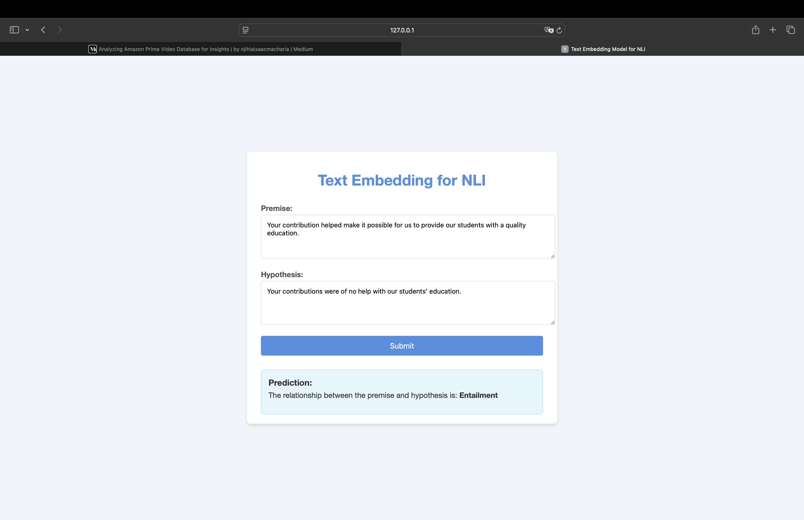

# BERT Model Implementation for Text Similarity and NLI Classification

## Overview

This assignment consists of implementing a BERT-based model from scratch, training it on a dataset, and using it for text similarity tasks. The trained model is used in conjunction with Sentence-BERT for generating semantically meaningful sentence embeddings. These embeddings are then compared using cosine similarity for Natural Language Inference (NLI) classification.

The assignment is divided into four tasks:

1. **Training BERT from Scratch**: Implementing BERT from scratch and training it on a suitable dataset.
2. **Sentence Embedding with Sentence-BERT**: Using the trained BERT model to build a Siamese network and perform sentence embedding.
3. **Evaluation and Analysis**: Evaluating model performance on NLI datasets.
4. **Text Similarity Web Application**: Creating a web application to demonstrate the capabilities of the trained model.

### Credits:
- **NLP Course at AIT by Chaklam**: The majority of this code, including its design and structure, was adapted from the **Natural Language Processing course at the Asian Institute of Technology (AIT)** by **Chaklam**. The course provided valuable insights and examples that shaped the code and the approach for language processing tasks in this context.
- **Chaklam's GitHub**: The code and resources for NLP tasks were also influenced by work shared on **Chaklam's GitHub**: [https://github.com/chaklam-silpasuwanchai](https://github.com/chaklam-silpasuwanchai).

## Task 1. Training BERT from Scratch

### Overview
This task implements **BERT (Bidirectional Encoder Representations from Transformers)** from scratch, following the **Masked Language Model (MLM)** and **Next Sentence Prediction (NSP)** objectives. The model is trained using a subset of the **BookCorpus dataset** and tested for inference.

### 1. Dataset Details
- **Dataset Used:** BookCorpus (subset of 80,000 sentences)
- **Source** BookCorpus. (n.d.). Retrieved from [Hugging Face Datasets](https://huggingface.co/datasets/bookcorpus). This dataset contains a large collection of books.

- **Preprocessing:**
  - Tokenization of sentences using a custom tokenizer
  - Conversion of words into numerical token IDs
  - Padding to ensure uniform sequence lengths
  - Splitting data into sentence pairs for the NSP task

### 2. Model Architecture
The implemented BERT model follows the original structure with the following key components:

- **Embeddings:**
  - **Token Embeddings:** Convert words into dense vector representations
  - **Segment Embeddings:** Distinguish between different input sentences in the NSP task
  - **Positional Embeddings:** Encode the order of words within a sequence

- **Transformer Encoder:**
  - **Multi-head Self-Attention Mechanism**
  - **Scaled Dot-Product Attention**
  - **Feed-forward Networks**
  - **Layer Normalization and Dropout**

### 3. Training Process
#### **Hyperparameters:**
- **Batch Size:** 6
- **Sequence Length:** 1000
- **Embedding Size:** 768
- **Hidden Layers:** 12
- **Attention Heads:** 12
- **Optimizer:** Adam
- **Learning Rate:** 0.001
- **Number of Epochs:** 1000

#### **Training Loss:**
- Final Loss : **3.956977**

#### **Saving Model Weights:**
```python
import torch

# Save model
torch.save(model.state_dict(), "bert_model.pth")

# Load model
model.load_state_dict(torch.load("bert_model.pth"))
```

### 4. Inference
The model is evaluated using masked token predictions and next sentence prediction. Below is an example inference result:

#### **Input Sentence:**
```plaintext
['[CLS]', 'it', "'s", 'not', 'like', 'he', "'s", 'using', 'it', 'much', 'these', 'days', '[SEP]', '``', 'i', 'never', 'said', 'i', 'did', "n't", 'want', 'you', 'two', 'to', 'get', 'to', 'know', '[MASK]', 'otheri', 'said', 'i', 'did', '[MASK]', 'want', '[MASK]', '[MASK]', 'him', 'for', 'a', 'fling', "''", '[SEP]']
```

#### **Masked Tokens (Original):**
```plaintext
["n't", 'you', 'each', 'days', 'using']
```

#### **Masked Tokens (IDs):**
```plaintext
[14707, 18180, 18304, 4037, 5460]
```

#### **Predicted Masked Tokens:**
```plaintext
['[PAD]', '[PAD]', '[PAD]', '[PAD]', '[PAD]']
```

#### **Next Sentence Prediction:**
- **Actual:** False
- **Predicted:** True

#### **Interpretation of NSP Result**
- **Ground Truth (isNext: False):** The second sentence was **not** the actual next sentence in the dataset.
- **Model Prediction (predict isNext: True):** The model incorrectly predicted it as the correct next sentence.

Possible reasons for the error:
1. **Undertrained Model** – At **epoch 1000**, loss is still relatively high (**3.956977**), indicating the model may not have learned sentence relationships well.
2. **Token Masking Impact** – Missing words may confuse the model’s understanding of sentence coherence.
3. **Limited Dataset** – Training on **80,000 sentences** is small compared to the original BERT dataset, affecting generalization.

#### **Improving NSP Accuracy**
- **More Training:** Increasing the number of epochs.
- **Larger Dataset:** Using additional text data to improve learning.
- **Hyperparameter Tuning:** Adjusting learning rates and batch sizes.

#### **Limitation**
- **Computational Resources:** The lack of access to high-performance computing resources, such as GPUs or specialized hardware, restricts the ability to efficiently train large-scale models. This limitation impacts the training time and overall performance, especially for resource-intensive tasks like BERT model training.
---

## Task 2. Sentence Embedding with Sentence-BERT (SBERT)

## Overview
This task implements **Sentence-BERT (SBERT)** using a Siamese network structure to derive semantically meaningful sentence embeddings. The model is trained on **SNLI** and **MNLI** datasets using a classification objective function (**SoftmaxLoss**) and evaluated using **cosine similarity**.

## 1. Dataset
### Source:
- **SNLI (Stanford Natural Language Inference)**. (n.d.). Retrieved from [Hugging Face Datasets](https://huggingface.co/datasets/snli). The SNLI dataset is used for training models in natural language inference tasks.

- **MNLI (Multi-Genre Natural Language Inference)**. (n.d.). Retrieved from [Hugging Face Datasets](https://huggingface.co/datasets/mnli). The MNLI dataset is used for evaluating models on a variety of text genres in the NLI task.

### Preprocessing:
- The **idx** column was removed from MNLI.
- **-1 labels** in SNLI (cases where no class could be decided) were filtered out.
- The two datasets were merged and shuffled.
- Sentences were tokenized using `BertTokenizer` with a **maximum sequence length of 128**.
- Input features:
  - `premise_input_ids`, `premise_attention_mask`
  - `hypothesis_input_ids`, `hypothesis_attention_mask`
  - `labels`

**Final dataset sizes (after selection for testing):**
- **Train:** 1,000 samples
- **Validation:** 1,000 samples
- **Test:** 100 samples

## 2. Model Architecture
- **Base model:** `bert-base-uncased`
- **Model Checkpoint Loading**
    - The trained model is saved and loaded using:
    ```python
    model.load_state_dict(torch.load('bert_model.pth'), strict=False)
    ```
    - The model uses parameters from **BERT trained from scratch** rather than pre-trained weights.
- **Sentence embeddings:**
  - Token embeddings extracted from `last_hidden_state`.
  - **Mean pooling** applied to get a fixed-size sentence embedding.
- **Siamese Network:**
  - Sentence embeddings `u` and `v` are processed to compute **|u - v|**.
  - A **classification head** is applied:
    \[ o = \text{softmax}\left(W^T \cdot \left(u, v, |u - v|\right)\right) \]

## 3. Training
### Hyperparameters:
- **Batch size:** 32
- **Epochs:** 5
- **Optimizer:** Adam (`lr=2e-5`)
- **Loss function:** CrossEntropyLoss
- **Scheduler:** Linear learning rate warm-up

### Training Results:
- **Final training loss:** `1.099586` (Epoch 5)

## 4. Inference & Evaluation
- **Cosine similarity** is used to compare sentence embeddings.
- **Average Cosine Similarity on Validation Data:** `0.7661`

### Example Inference:
**Input Sentences:**
1. *"Your contribution helped make it possible for us to provide our students with a quality education."*
2. *"Your contributions were of no help with our students' education."*

**Predicted Cosine Similarity:** `0.8057`

## Task 3: Evaluation and Analysis

### 1. Performance Metrics
The model was evaluated on the SNLI and MNLI datasets using accuracy and cosine similarity.

**Performance Table:**

| Model Type | Dataset | Accuracy (%) | Average Cosine Similarity |
|------------|---------|--------------|---------------------------|
| Our Model  | SNLI/MNLI | 35.08       | 0.7661                   |

### 2. Challenges and Limitations
#### **Issue with Loading Custom BERT Weights**
During implementation, a major challenge was encountered when attempting to load parameters from `bert_model.pth`, which contained weights from a BERT model trained from scratch. The issue was that these parameters did not match the pre-trained `bert-base-uncased` model.

##### **Error Details:**
- Even with `strict=False`, the model failed to properly load all parameters due to mismatches.
- The output embeddings of the pre-trained model (without custom weights) and the model using `bert_model.pth` were identical, suggesting that the custom weights were not effectively integrated because the output cosine-similarity between two models are same.
- The alternate model I developed is located in `S-BERT-modify.ipynb`. However, during training, the loss was unusually high (`124.981514`), suggesting potential issues with weight initialization or incompatibility with the model architecture. As a result, I decided to proceed with the model from `S-BERT.ipynb`.

```python
import torch
from transformers import BertModel

# Initialize the model
model = BertModel.from_pretrained('bert-base-uncased')

# Load the saved state_dict (weights) into the model
model.load_state_dict(torch.load('bert_model.pth'), strict=False)
```

### 3. Proposed Improvements
To address these challenges, the following modifications and improvements are proposed:

1. **Verify the Weight File (`bert_model.pth`)**:
   - Check whether it contains all expected layers and parameters.
   - Compare the tensor shapes with the pre-trained `bert-base-uncased` model.

2. **Ensure Compatibility Between Custom and Pretrained Models**:
   - If using a BERT model trained from scratch, ensure it has the same architecture and tokenizer as `bert-base-uncased`.
   - If the model was fine-tuned on a different architecture, adjustments to the layer definitions might be needed.

3. **Reduce Training Loss**:
   - Investigate learning rate and optimizer settings.
   - Experiment with gradient clipping or weight initialization techniques to stabilize training.
   - Consider training with a larger and more balanced dataset.

## Task 4: Text Similarity Web Application

### Description:
- Develop a simple web application to demonstrate the capabilities of the trained model.
- The application takes two input sentences and predicts their relationship using NLI classification.

### Features:
- **Premise**: A sentence that provides context.
- **Hypothesis**: A sentence whose relationship with the premise is classified as Entailment, Contradiction, or Neutral.

### Web Application Implementation:
- Flask was used to build the web application.
- Users can input a premise and hypothesis, and the model predicts the relationship between them.

### Example Input and Output:
- **Premise**: "A man is playing a guitar on stage."
- **Hypothesis**: "The man is performing music."
- **Prediction**: "Entailment"

## Web: Text similarity



## How to Run the Project

1. **Set up the environment**:
   - Create a Python virtual environment.
   - Install the required dependencies (e.g., `torch`, `transformers`, `flask`, `scikit-learn`, etc.).

2. **Train the BERT model**:
   - Run the BERT training script to train the model on the selected dataset.

3. **Train Sentence-BERT**:
   - Use the pre-trained BERT model to train Sentence-BERT using the NLI dataset.

4. **Evaluate the model**:
   - Run the evaluation script to assess the model's performance on the NLI dataset.

5. **Run the web application**:
   - Launch the Flask web app to test the model with real-time inputs.