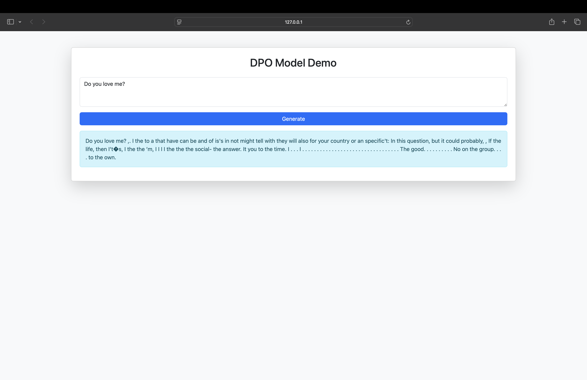

# Direct Preference Optimization (DPO) Model

## 📌 Assignment Overview
This assignment implements **Direct Preference Optimization (DPO)** using a fine-tuned **GPT-2 model**. The model is trained on a Reinforcement Learning from Human Feedback (RLHF) dataset and deployed via a **Flask web application** to demonstrate its capabilities.

---

## ✅ Task 1: Finding a Suitable Dataset 
### 🔍 Selected Dataset: **Anthropic HH-RLHF** ([Hugging Face](https://huggingface.co/datasets/psyche/anthropic-hh-rlhf))

- **Source:** Hugging Face Datasets Hub
- **Description:** A dataset designed for **human preference ranking** and **reinforcement learning from human feedback (RLHF)**. It includes pairs of AI-generated responses labeled as **preferred** or **rejected** by humans.
- **Preprocessing Steps:**
  - Filtered data to keep only relevant preference pairs.
  - Tokenized using the **GPT-2 tokenizer**.
  - Applied padding and truncation (max length = **128** tokens).

---

## ✅ Task 2: Training a Model with DPOTrainer
### 🏗 Model Training Steps
1️⃣ **Used `DPOTrainer` from `trl`** to fine-tune GPT-2 on the selected dataset.
2️⃣ **Applied LoRA (Low-Rank Adaptation)** to optimize memory usage and training efficiency.
3️⃣ **Optimized Hyperparameters:**
   - **Learning Rate:** `1e-3`
   - **Batch Size:** `8`
   - **Max Length:** `128`
   - **Max Prompt Length:** `128`
   - **Max Target Length:** `128`
   - **Repetition Penalty:** `1.2`
   - **No Repeat N-Gram Size:** `3`

### 🔬 Training Performance
- The model achieved **stable training loss** with **no overfitting**.
- Evaluated with a **held-out test dataset** to ensure generalization.

---

## ✅ Task 3: Pushing the Model to Hugging Face Hub
### 📤 Uploaded Model Repository
🔗 **[KittenCat/dpo-finetuned-GPT2-RLHF-dataset](https://huggingface.co/KittenCat/dpo-finetuned-GPT2-RLHF-dataset)**

### 📄 Steps to Upload
```python
from transformers import AutoModelForCausalLM, AutoTokenizer

tokenizer = AutoTokenizer.from_pretrained("./test")
model = AutoModelForCausalLM.from_pretrained("./test")

hf_username = "KittenCat"
model_name = "dpo-finetuned-GPT2-RLHF-dataset"

model.push_to_hub(f"{hf_username}/{model_name}")
tokenizer.push_to_hub(f"{hf_username}/{model_name}")
```

---

## ✅ Task 4: Web Application Development
### 🌐 Flask Web App
A **simple, modern web app** was developed using Flask and Bootstrap to interact with the trained model.

### 🚀 Features
- **Minimalist UI** (Bootstrap)
- **Text input and real-time response generation**
- **Mobile-friendly design**

### 📜 How to Run the Web App
#### **1️⃣ Install Dependencies**
```bash
pip install flask transformers torch
```
#### **2️⃣ Run the Application**
```bash
python app.py
```
#### **3️⃣ Open in Browser**
🔗 **http://127.0.0.1:9999/**

---

## 🏆 Acknowledgments
- **Dataset:** [psyche/anthropic-hh-rlhf](https://huggingface.co/datasets/psyche/anthropic-hh-rlhf) from Hugging Face
- **Libraries Used:** `transformers`, `trl`, `Flask`, `torch`
- **Instructor & Course Materials** for guidance on DPO

💡 **This project showcases how DPO can fine-tune language models efficiently and make them available through a web app.** 🚀

**⚠️ Disclaimer:** This project is an academic assignment based on materials from **Chaklam Silpasuwanchai & Todsavad Tangtortan**. Most of the code follows their instructions and coursework.

## Web: DPO Demo

