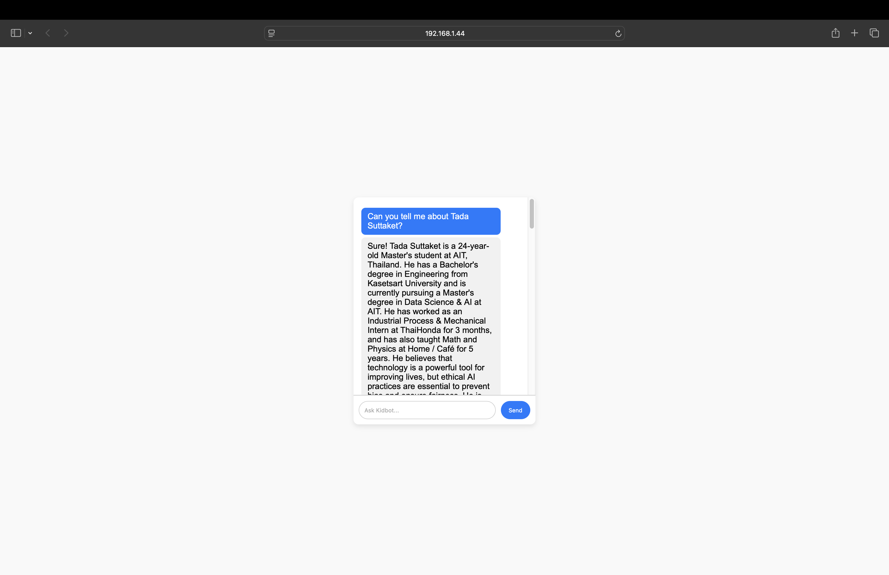
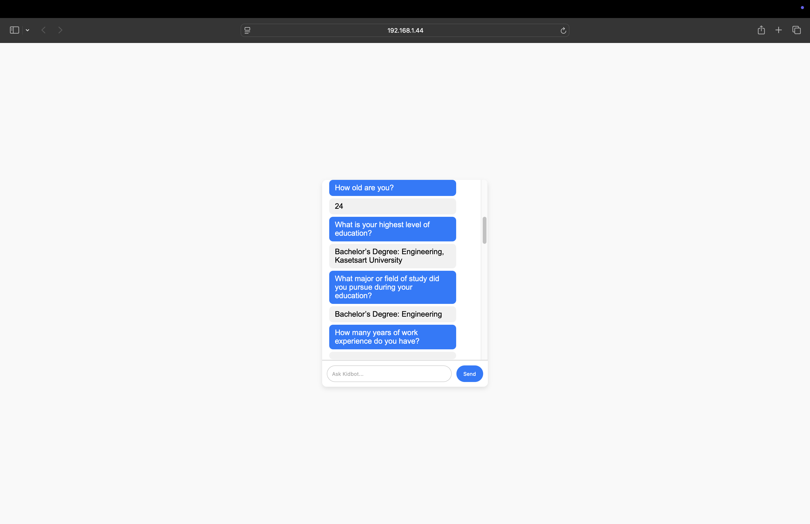

# RAG-Based Chatbot with FastChat-T5-3B

## Project Overview
This project involves developing a RAG (Retrieval-Augmented Generation) chatbot that answers questions related to personal information. The chatbot is designed to provide informative and well-structured responses while referencing relevant documents or sources. The chatbot is deployed as a web application with a user-friendly interface.

## Tasks and Implementation

### Task 1: Source Discovery
#### 1. Reference Documents
- The chatbot utilizes the following sources for retrieving personal information:
  - Personal data provided in the uploaded documents.
  - The personal data is about me, but inconsistencies or formatting issues may cause retrieval conflicts.

#### 2. Prompt Design
- The chatbot uses a structured prompt template to ensure responses are informative and polite. However, some responses may be incomplete or generic due to:
  - Conflicting or ambiguous information in the retrieved data.
  - Limitations in the prompt design that may not guide the model effectively.
  - Challenges in retrieval where the chatbot may not extract the most relevant portions of personal data.

#### 3. Model Exploration
- The chatbot was tested with various text-generation models, including OpenAI's models and Groq’s LLaMA3-70B. However, due to resource constraints, `fastchat-t5-3b-v1.0` was chosen for deployment as it provides faster responses.

### Task 2: Analysis and Problem Solving
#### 1. List of Retriever and Generator Models Used
- **Retriever Model:** FAISS (Facebook AI Similarity Search)
- **Generator Model:** `fastchat-t5-3b-v1.0`
- **Alternative Model:** `llama-3.2-3B` (provided better responses but was resource-intensive)

#### 2. Issues Encountered
- Some responses contained unrelated or incomplete information due to:
  - Document retrieval mismatches and conflicting personal data.
  - Formatting inconsistencies that affected proper extraction.
  - The chatbot generating vague responses due to suboptimal prompt structuring.
- Using `llama-3.2-3B` led to incomplete responses due to resource limitations, though its answers were generally better.
- The chatbot struggled with answering specific questions about personal details, even when relevant data was available, indicating possible retrieval inefficiencies.

### Task 3: Chatbot Development (Web Application)
#### Features
- Interactive chat interface with an input box for user queries.
- Responses generated based on relevant retrieved documents.
- Answers include citations or references where applicable.

#### Example Questions the Chatbot Can Answer
1. How old are you?
2. What is your highest level of education?
3. What major or field of study did you pursue during your education?
4. How many years of work experience do you have?
5. What type of work or industry have you been involved in?
6. Can you describe your current role or job responsibilities?
7. What are your core beliefs regarding the role of technology in shaping society?
8. How do you think cultural values should influence technological advancements?
9. As a master’s student, what is the most challenging aspect of your studies so far?
10. What specific research interests or academic goals do you hope to achieve during your time as a master’s student?

#### JSON Submission Format
```json
[
  {
    "question": "How old are you?",
    "answer": "24"
  },
  {
    "question": "What is your highest level of education?",
    "answer": "Bachelor’s Degree: Engineering, Kasetsart University"
  },
  {
    "question": "What major or field of study did you pursue during your education?",
    "answer": "Bachelor’s Degree: Engineering"
  },
  {
    "question": "How many years of work experience do you have?",
    "answer": "The chatbot was unable to provide an exact answer due to conflicting or insufficiently structured personal data."
  },
  {
    "question": "What type of work or industry have you been involved in?",
    "answer": "Work Experience Total Experience: 5 years Workplace: Home / Café (Freelance Tutor) Role: Math & Physics Tutor (Secondary Education) Key Responsibilities: o Teaching Mathematics and Physics to high school students preparing for university entrance exams. o Helping students improve their grades and problem-solving skills. However, further details on other roles or industries were not found in the provided data."
  },
  {
    "question": "Can you describe your current role or job responsibilities?",
    "answer": "The chatbot could not generate a precise answer due to potential formatting inconsistencies in the reference documents."
  },
  {
    "question": "What are your core beliefs regarding the role of technology in shaping society?",
    "answer": "Technology can be a powerful tool for improving lives, but ethical AI practices are essential to prevent bias and ensure fairness. Cultural diversity should guide technological advancements, ensuring inclusivity in AI-driven solutions. AI should be designed to be transparent and accountable, ensuring that it is used for the benefit of all individuals and communities."
  },
  {
    "question": "How do you think cultural values should influence technological advancements?",
    "answer": "Cultural diversity should guide technological advancements, ensuring inclusivity in AI-driven solutions. However, specific examples related to personal views were not fully retrieved due to possible data conflicts."
  },
  {
    "question": "As a master’s student, what is the most challenging aspect of your studies so far?",
    "answer": "Transitioning from engineering to data science has been the most challenging aspect of my master’s studies so far."
  },
  {
    "question": "What specific research interests or academic goals do you hope to achieve during your time as a master’s student?",
    "answer": "Long-term academic and research goals as a master’s student are to contribute to NLP research, focusing on real-world AI applications, and continue learning and exploring the intersection of AI and ethics. However, further details on specific projects or interests may require additional data."
  }
]
```

## Future Improvements
- Enhance retrieval model for more relevant document matching.
- Improve consistency in personal data formatting to reduce conflicts.
- Optimize chatbot performance for more resource-efficient responses.
- Improve response coherence by fine-tuning `fastchat-t5-3b-v1.0` with more contextual training data.

## Web: KIDBOT Demo


